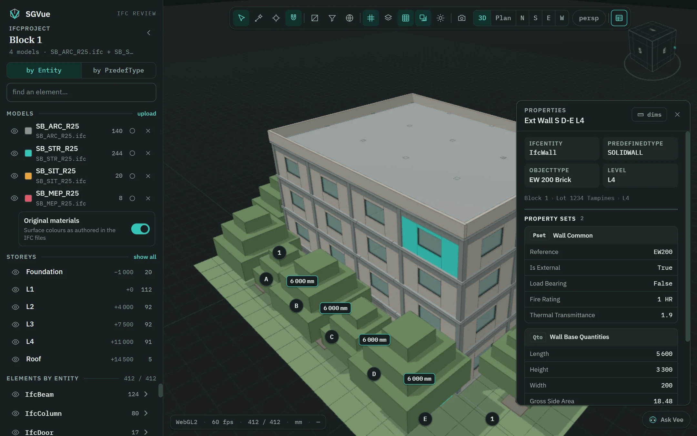

# SGVue

SGVue is a free desktop viewer for IFC building models, made for BIM coordination review on
Windows and macOS. Open one IFC file or several at once, isolate by storey or by rule, cut
sections along a gridline and at a level, measure with snapping, read every property set,
build schedules in a window of their own, colour the model by any property — and, if you set
it up, ask **Vee**, the built-in assistant, about the model in plain language. SGVue is
**read-only**: it never edits or saves a model.



## Features

- **Federation** — several IFC files (IFC2X3, IFC4, IFC4X3; `.ifc` or `.ifczip`) in one view,
  each with its own visibility, colour and activate mode.
- **Find and filter** — storeys, models and an element tree by IFC entity or predefined type; a
  filter stack of rules that hide, isolate or highlight; saved filter sets.
- **Sections** — one cut along a gridline and one at a level, together, each with its own
  offset and side.
- **Measure** — a laser measurement and spot levels with corner and edge snapping; gridlines
  with bubbles and the dimensions between them.
- **Properties** — every property set and quantity of the selected element, and the model's
  georeferencing, including the CORENET X (Singapore) convention.
- **Schedules** — Revit-style schedules in a second window, linked to the 3D view, with export
  to Excel and CSV.
- **Views** — saved viewpoints, colour by any property, and `sgvue://` links that reopen the
  same view when the same files are at hand.
- **Ask Vee (optional)** — an AI assistant that answers questions and works the view for you,
  using your own Anthropic API key. It cannot change your model, and it asks before anything
  that cannot be undone.

## Download

Installers are published at **https://github.com/sgvue/releases/releases/latest**, and the
product site is **https://sgvue.github.io/**. Help › Check for updates… opens the site.

- **Windows 10 or 11 (64-bit):** download `SGVue-<version>-setup.exe` and run it. It installs
  for your user only, without administrator rights, and updates an existing install in place.
  It is not code-signed yet, so Windows may show *"Windows protected your PC"*: choose
  **More info → Run anyway**.
- **macOS 13 or later (Apple silicon and Intel):** published from 1.2.0 on. Download
  `SGVue-<version>-arm64.dmg` for Apple silicon or `SGVue-<version>-x64.dmg` for an Intel Mac,
  open it and drag SGVue onto Applications. The build is not notarised, so the first launch
  needs one extra step: open SGVue once, then **System Settings → Privacy & Security → Open
  Anyway** (on macOS 13 and 14, Control-click the app and choose **Open**).

## Privacy

- **Your model files never leave your computer.** They are opened and parsed locally; SGVue
  uploads nothing, has no account and collects no usage data.
- **One update check per launch.** The installed app sends one request to GitHub
  (`api.github.com/repos/sgvue/releases/releases/latest`) to learn the newest version number.
  It carries no query, body or cookie and nothing about you or your models; GitHub sees what any
  web server sees — your IP address and standard browser headers, whose user agent names SGVue
  and its version. Offline or blocked, it stays silent. Nothing is downloaded automatically.
- **Ask Vee is optional, and off until you enter your own Anthropic API key** (Preferences…:
  **SGVue → Preferences…** on macOS, **File → Preferences…** on Windows). From then on, each
  question goes to Anthropic's API together with a summary of the loaded models' vocabulary
  (model, storey and gridline names; IFC entity, type and property names, with counts), the
  current view, and the results of the look-ups the assistant makes — which can include element
  names, property values, GlobalIds, raw STEP lines, the project's name and address, the
  georeferencing base point and the file's SHA-256. The IFC file itself is never sent. The exact
  list is in
  [`docs/AI_REVIEW.md` — "Exactly what leaves this machine"](docs/AI_REVIEW.md#exactly-what-leaves-this-machine),
  and **Preferences → Data sent to AI** shows the last request. The key is encrypted by the
  operating system (Keychain on macOS, DPAPI on Windows) and is never shown again.

## System requirements

| | |
|---|---|
| **System** | Windows 10 or 11, 64-bit · macOS 13 or later, Apple silicon or Intel |
| **Memory** | About 8 GB for IFC files up to about 100 MB, 16 GB up to about 300 MB, and 32 GB for larger files up to 600 MB; with several models open, add their sizes together (measured on one PC) |
| **Graphics** | Any graphics card with WebGL2. On a Windows PC with an NVIDIA card, SGVue uses it |
| **Files** | `.ifc` or `.ifczip`, built for typical files of 50–200 MB; a single file over 600 MB is not opened |
| **Disk (Windows)** | About 110 MB to download and 390 MB installed |
| **Internet** | Not needed to view models — only for the update check and for Ask Vee |

## Build from source

You need **Node.js 22.12 or later** (the repository's `.nvmrc` says 24), npm and Git, on
Windows or macOS.

```bash
git clone https://github.com/sgvue/sgvue.git
cd sgvue
npm ci
npm run build      # type-check, then build into out/
npm test           # unit tests and the read-only guard (vitest)
npm run dist:win   # Windows installer into dist/   (npm run dist:mac on a Mac)
```

**Electron is only ever started through the guard scripts** — `npm run test:e2e`,
`node scripts/safe-run.cjs <script>` and `node scripts/safe-app.cjs` — and **never with
`npm run dev` or a bare `npx electron`**. An unguarded development window once let the GPU
process grow without bound and crashed the development Mac three times; the guards watch its
memory, stop the run when it goes over budget, and kill only what they started.
[CONTRIBUTING.md](CONTRIBUTING.md) has the rules and [docs/COMMANDS.md](docs/COMMANDS.md)
every command.

Your own IFC files go in `samples/`, which is git-ignored: never commit a real project model.

## How the repository is laid out

| Path | What |
|---|---|
| `src/main` · `src/preload` · `src/renderer` · `src/shared` · `src/worker` · `src/schedule` | The application |
| `tests/` | Unit tests, the read-only guard, the Electron end-to-end suite |
| `scripts/` | The guards, the parity and evaluation harnesses, the generators |
| `design-reference/` | The design — the specification of record for everything visible. Read-only |
| `docs/SYSTEM_SPEC.md` | What the app is, how it is built and what it promises |
| `docs/DECISIONS.md` | Every decision, dated, with its reasoning and measurements |
| `docs/TRAPS.md` | The parser and renderer traps — read before touching `src/worker` or `src/renderer/viewer` |
| `docs/AI_REVIEW.md` · `docs/AI_EVAL.md` | The assistant's audit and its evaluation suite |
| `docs/releases/` | Release notes, one file per version from 1.2.0 |
| `CHANGELOG.md` | The released versions in brief |
| `CLAUDE.md` · `PROGRESS.md` | The working notes and history of building SGVue with AI agents. Commit hashes cited in them from before the public repository's first commit (`27fb7ee`, 2026-10-05) refer to the project's private history and do not resolve in this repository; later ones do |

## Contributing

Bug reports, questions and pull requests are welcome — read
[CONTRIBUTING.md](CONTRIBUTING.md) first, and [SUPPORT.md](SUPPORT.md) for where to ask.
Everyone taking part follows the [Code of Conduct](CODE_OF_CONDUCT.md). Please never attach a
confidential model to an issue.

## Security

Report a vulnerability privately, as [SECURITY.md](SECURITY.md) describes — not in a public
issue.

## Licence

SGVue is licensed under the [Apache License 2.0](LICENSE); see [NOTICE](NOTICE). The
third-party software it ships, and each component's licence, is listed in
[THIRD_PARTY_NOTICES.md](THIRD_PARTY_NOTICES.md); all three files are in every installer.

The licence grants no right to use the name SGVue or its logo (Apache License 2.0, section 6).

## Credits

Made by **Yong Yen**, an architectural professional — built with Claude. SGVue stands on
[web-ifc](https://github.com/ThatOpen/engine_web-ifc), [three.js](https://threejs.org/),
[Electron](https://www.electronjs.org/) and the other open-source projects in
[THIRD_PARTY_NOTICES.md](THIRD_PARTY_NOTICES.md).
